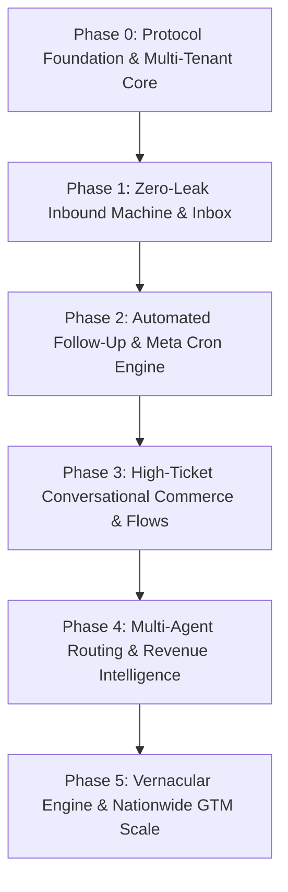
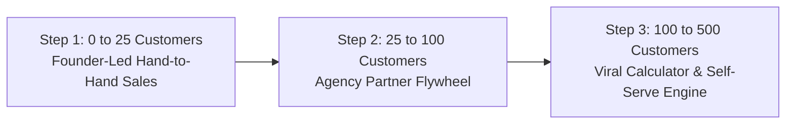

# ⚓ ANCHOR — Master Blueprint & Execution Roadmap (Zero to Scale)

> **Document Type:** Master Strategy, System Architecture & Phase-Wise Roadmap  
> **Brand Identity:** Anchor (`Anchor.`) — The WhatsApp Follow-Up & Revenue Recovery Machine  
> **Target Market:** Indian High-Ticket SMBs & Mid-Market (Real Estate, Healthcare, D2C, EdTech)  
> **Tech Philosophy:** **Zero AI Hallucinations** — 100% Deterministic Speed, Heuristic Intent Scoring, Meta Cloud API Protocol Compliance  

---

## 1. Executive Summary & The Core Thesis

### The Macro Problem
Every month, Indian businesses spend between **₹50,000 and ₹25,00,000** on Meta Ads (Facebook/Instagram Click-to-WhatsApp ads) and Google Ads. 
However, **60% to 70% of inbound WhatsApp leads leak and die without conversion** due to three fundamental flaws:
1. **Response Latency:** Average human sales rep responds in **3 to 6 hours**. Lead research shows customer conversion drops by **391%** after the first 5 minutes.
2. **Meta 24-Hour Policy Cliff:** After 24 hours of customer inactivity, Meta closes the free-form conversational session. Amateurs blast unapproved text and get their official numbers permanently banned.
3. **Zero Visibility on Lost Revenue:** Business owners have no dashboard quantifying: *"How much money did we lose this week because an agent didn't follow up on time?"*

### Why "Zero AI" Is Our Biggest Competitive Advantage
Most modern SaaS startups attempt to slap generic OpenAI/Gemini chatbots on WhatsApp. In high-ticket Indian commerce, this fails catastrophically:
- **Hallucinations:** AI quotes incorrect flat prices, offers unapproved discounts, or invents inventory.
- **Tone Disconnect:** Robotic, overly polite English bot replies alienate Indian buyers who text in concise, hybrid Hinglish.
- **Latency:** LLM API roundtrips take 3–8 seconds, breaking the conversational rhythm.

**The Anchor Thesis:**  
Indian sales teams don't want a bot that tries to write poetry. They want a **high-speed machine**:
- **< 2s Deterministic Auto-replies** based on explicit keywords and time of day.
- **0–100 Intent Scoring Dial** that detects commercial signals (`"site visit"`, `"budget"`, `"carpet area"`, `"cheque"`).
- **Automated Protocol Handover:** Seamlessly toggles from free text to Meta-Approved Utility Templates at Hour 23.
- **Human Speed Shortcuts:** `/` slash commands, instant tagging, and multi-agent coordination.

---

## 2. Competitive Landscape & Market Gaps

### Competitor Matrix (Indian Landscape)

| Dimension | **Anchor** | **Wati.io** | **Interakt** | **AiSensy** | **DoubleTick** |
| :--- | :--- | :--- | :--- | :--- | :--- |
| **Primary Focus** | **Lead Recovery & Speed** | No-code bot builder | E-commerce catalog | Broadcast marketing | Field sales mobile CRM |
| **Starting Price** | **₹999 / ₹2,499 flat** | \$49 (~₹4,100) | ₹999 + markups | ₹999 + markups | ₹2,500 (Annual lock) |
| **Meta Fee Markup** | **0% (Direct Pass-through)** | 15–25% hidden markup | Hidden conversation markups | Extra charges on API | Bundled |
| **Lead Intent Dial** | **Built-in (0–100 Dial)** | ❌ None | ❌ None | ❌ Basic status | ❌ Manual stages |
| **Leakage Calculator** | **Built-in (₹ Value Tracker)**| ❌ None | ❌ None | ❌ None | ❌ None |
| **24h Meta Gate** | **Automated Hour 23 Switch** | Manual warning | Manual template blast | Campaign only | Basic reminder |
| **A/B Testing** | **50/50 Split Conversion** | ❌ None | ❌ None | Basic campaign | ❌ None |

### The 4 Unmet Needs Anchor Solves
1. **Revenue Quantification:** Instead of showing "Unread Messages: 14", Anchor shows *"₹18,50,000 in pipeline at risk of expiring in 3 hours"*.
2. **Deterministic Speed:** Auto-replies trigger within 1.5 seconds directly inside the webhook pipeline.
3. **Safe Multi-Agent Access:** 5 to 20 sales reps can handle leads simultaneously on a single corporate WhatsApp number without physical SIM sharing.
4. **Transparent Economics:** No hidden markups on Meta’s official messaging fees.

---

## 3. Phase-by-Phase Master Execution Roadmap

Here is the complete zero-to-scale roadmap broken down into **6 structured phases**:

---

### 🔹 PHASE 0: Protocol Foundation & Multi-Tenant Core (Weeks 1–2)
**Goal:** Build a rock-solid, production-grade Meta Cloud API gateway that can ingest 10,000+ webhooks/minute with zero data loss and absolute cryptographic security.

#### 1. Technical Components:
- **Meta Cloud API Webhook Gateway:**
  - `GET /api/webhook/meta` for Meta challenge handshake (`hub.challenge`, `hub.verify_token`).
  - `POST /api/webhook/meta` for inbound event ingestion.
  - HMAC-SHA256 signature verification (`x-hub-signature-256`) against `META_APP_SECRET`.
- **High-Throughput Ingestion Queue:**
  - Fast response (`200 OK` in <50ms to Meta to prevent retry storms).
  - Offload payload to async event queue (BullMQ + Redis with fallback to in-memory event bus).
- **Multi-Tenant Database Architecture:**
  - Multi-tenant data isolation (`Organization`, `User`, `Lead`, `Message`, `Template`, `AuditLog`).
  - Prisma ORM configured for PostgreSQL / custom persistent data engine.
- **Authentication & Security:**
  - JWT token lifecycle (`anchor_auth_token`), bcrypt password hashing, and role hierarchy (`OWNER`, `MANAGER`, `AGENT`).

#### 2. Key Deliverable:
A verified backend that receives raw WhatsApp messages from real devices, parses payloads (text, buttons, media, interactive messages), and assigns them to the correct business tenant.

---

### 🔹 PHASE 1: Zero-Leak Inbound Machine & High-Velocity Inbox (Weeks 3–4)
**Goal:** Deliver the fastest, cleanest web inbox for sales teams that cuts initial response time from hours to under 2 seconds.

#### 1. Technical Components:
- **Sub-30s Instant Auto-Reply Engine:**
  - Inbound keyword evaluation (`default`, `exact match`, `regex match`, `working hours` rules).
  - Variable interpolation (`{{name}}`, `{{business}}`, `{{phone}}`, `{{time}}`).
  - Deduplication lock: prevents spamming leads who send multiple consecutive messages.
- **Deterministic Lead Intent Scoring Engine (0–100):**
  - **Budget Triggers:** Mentions of `"Cr"`, `"Lakh"`, `"budget"`, `"price"` (+25 pts).
  - **Timeline Triggers:** `"immediate"`, `"this weekend"`, `"urgent"`, `"ready to move"` (+30 pts).
  - **Action Triggers:** `"site visit"`, `"appointment"`, `"call me"`, `"location"` (+35 pts).
  - **Decay Algorithm:** Inactive leads lose 5 points every 12 hours.
- **High-Velocity Shared Team Inbox (`LeadInbox.tsx`):**
  - Left panel: Search, status filters (`NEW`, `CONTACTED`, `QUALIFIED`, `WON`, `LOST`), and custom tag filters.
  - Center panel: Real-time chat bubbles, read receipts (`✓✓`), audio playback, media previews.
  - Right panel: Lead Intelligence (0-100 dial, lead value ₹, tags, contact metadata, timeline).
- **Productivity Superchargers:**
  - **Quick Reply Shortcuts (`/`):** Typing `/` pops up template suggestions (`/visit`, `/brochure`, `/pricing`) with instant variable replacement.
  - **Lead Tagging & Smart Filters:** Custom colored tags (`Hot 🔥`, `Penthouse`, `Commercial`).
  - **CSV Lead Import & Export:** Seamless data ingestion and download for external CRM backup.

#### 2. Key Deliverable:
A complete, functioning web app where sales executives can manage conversations, auto-reply to leads, score intent, and search past threads without lag.

---

### 🔹 PHASE 2: Automated Follow-Up & Meta Cron Engine (Weeks 5–6)
**Goal:** Solve the Meta 24-hour policy cliff and automate multi-day follow-up cadences so no prospect is ever forgotten.

#### 1. Technical Components:
- **Meta 24-Hour Policy State Machine:**
  - Calculates `lastInboundTimestamp` down to the second.
  - While `timeSinceInbound < 24h`: Permits standard, conversational messages.
  - At `timeSinceInbound == 23h`: Triggers automated **Session Warning Nudge**.
  - When `timeSinceInbound >= 24h`: Locks free text input and restricts outgoing outreach to approved Meta Utility/Marketing templates.
- **Automated Drip Sequences (Cron Worker):**
  - **Sequence 1 (1 Hour):** *"Hey {{name}}, saw you inquired about {{property}}. Did you get a chance to check the brochure?"*
  - **Sequence 2 (23 Hours):** *"{{name}}, our direct WhatsApp chat window closes in 1 hour. Can I confirm your slot for tomorrow?"*
  - **Sequence 3 (72 Hours - Meta Template):** Re-engagement template with quick-reply buttons (`[Yes, Still Interested]`, `[Book Site Visit]`).
- **Template A/B Testing Engine:**
  - 50/50 split testing on auto-replies and follow-up templates.
  - Real-time conversion tracking (`sentCount`, `replyCount`, `replyRate%`).
  - 1-Click *"Promote as Winner"* action.

#### 2. Key Deliverable:
Zero WhatsApp number bans. Automated revival of cold leads without human intervention.

---

### 🔹 PHASE 3: High-Ticket Conversational Commerce & Flows (Weeks 7–9)
**Goal:** Turn WhatsApp into a full qualification and transaction channel using Meta's latest native features.

#### 1. Technical Components:
- **WhatsApp Flows Integration (Interactive Forms):**
  - Native multi-screen forms rendered directly inside WhatsApp without opening external browser windows.
  - Real Estate Flow: `[Budget Range] → [Configuration: 2BHK/3BHK/Villa] → [Preferred Site Visit Date]`.
  - Healthcare Flow: `[Doctor Specialization] → [Date/Time Slot] → [Patient Name]`.
  - Inbound flow completion automatically creates a 100/100 scored lead in Anchor.
- **Click-to-WhatsApp (CTWA) Ad Attribution:**
  - Ingestion of Meta Ad referral data (`ad_id`, `campaign_id`, `source_type`).
  - Direct attribution dashboard: Shows which Facebook/Instagram ad generated which qualified deal.
- **In-Chat Payment Links (Razorpay Integration):**
  - Instant token/booking amount collection link sent inside chat.
  - Webhook listener updates lead status to `WON` upon payment confirmation.

#### 2. Key Deliverable:
Customers book site visits and pay booking deposits without leaving WhatsApp.

---

### 🔹 PHASE 4: Multi-Agent Routing & Revenue Intelligence (Weeks 10–12)
**Goal:** Support large enterprise sales teams (10 to 50 agents) and provide founders with executive analytics.

#### 1. Technical Components:
- **Intelligent Lead Distribution:**
  - **Round-Robin Routing:** Evenly distributes new incoming leads among active agents.
  - **Skill-Based Routing:** Real estate leads tagged `Commercial` go to the commercial leasing team; leads tagged `Luxury` go to senior brokers.
  - **Claim & Reassignment:** Agents can claim unassigned leads or transfer with internal notes.
- **Agent Performance & SLA Monitoring:**
  - Tracks **First Response Time (FRT)** per agent.
  - Tracks **Resolution Rate** and **Deal Conversion Rate**.
  - Leaderboard view for sales managers.
- **Daily Executive Revenue Leakage Reports:**
  - Automated 8:00 AM summary sent via WhatsApp and Email to the business owner:
    - *Leads Received:* 84
    - *Responded < 2 mins:* 76 (90.4%)
    - *Leads Leaked (No reply in 24h):* 8
    - *Revenue at Risk:* ₹12,00,000

#### 2. Key Deliverable:
Business owners can step away from daily sales operations and manage by exception via daily executive reports.

---

### 🔹 PHASE 5: Vernacular Engine & Nationwide GTM Scale (Month 4+)
**Goal:** Expand across Tier-1, Tier-2, and Tier-3 Indian cities with localized capabilities and scaled distribution.

#### 1. Technical Components:
- **Hinglish & Regional Rule Matcher:**
  - Pattern matching for hybrid Hindi-English phrases:
    - *"Kab visit kar sakte hain?"* → Triggers Site Visit Flow.
    - *"Price kya hai?" / "Rate kitna padega?"* → Triggers Price Breakdown.
    - *"Location kahan hai?"* → Sends Google Maps pin.
  - Support for Marathi, Gujarati, Telugu, and Tamil keywords.
- **Official Meta Tech Provider Status:**
  - Embedded Signup flow (Onboard clients in 60 seconds with their Facebook Business Manager).
  - Fast-track Official Green Tick Verification assistance.
- **Public Integration Hub:**
  - Native 2-way Google Sheets synchronization (preferred database for Indian SMBs).
  - Zapier & Make.com webhooks.
  - LeadSquared & Zoho CRM connectors.

---

## 4. Monetization Model & Unit Economics

### Pricing Architecture (Billed in INR)

| Tier | Monthly Price | Annual Price (Save 20%) | Target Customer | Active Leads | Seats |
| :--- | :--- | :--- | :--- | :--- | :--- |
| **Starter** | **₹999 / mo** | ₹799 / mo (₹9,588/yr) | Solo brokers, clinics, boutique stores | Up to 1,000 | 1 |
| **Growth** *(Hero)* | **₹2,499 / mo** | ₹1,999 / mo (₹23,988/yr) | Scaling sales teams, high-ticket agencies | Up to 5,000 | 3 |
| **Business Scale** | **₹4,999 / mo** | ₹3,999 / mo (₹47,988/yr) | Multi-project builders, coaching centers | Unlimited | 10 |
| **Enterprise** | Custom Quote | Custom Annual Contract | Large developers (DLF, Godrej channel partners) | Custom | 25+ |

### The Secret Meta Arbitrage (Why Margins Are Huge)
- **Meta Policy:** The **first 1,000 service conversations per month are 100% FREE** from Meta.
- Since Anchor primarily optimizes *inbound customer inquiries*, the majority of our SMB clients pay **₹0 in Meta message fees** during their first few months!
- We pass Meta charges at **100% pure cost (0% markup)**. This builds enormous customer goodwill compared to competitors like Wati or Zoko who secretly markup conversation fees by 20–30%.
- **Gross Margins for Anchor:** **> 88%** (Pure SaaS software economics).

### Target Unit Economics (Year 1)
- **Customer Acquisition Cost (CAC):** ₹2,000 (Via founder direct sales, meta ads, and agency partnerships).
- **Average Revenue Per User (ARPU):** ₹2,200 / month.
- **Average Customer Lifespan:** 14 months.
- **Customer Lifetime Value (LTV):** ₹30,800.
- **LTV : CAC Ratio:** **15.4x** (Extremely healthy capital efficiency).

---

## 5. Go-To-Market (GTM) Strategy: 0 to 500 Paying Customers

### Step 1: The "First 25" (Founder-Led Guerilla Sales)
- **Target Vertical:** Independent Real Estate Brokers & Channel Partners in **Gurugram (Golf Course Road / Dwarka Expressway)** and **Bangalore (Whitefield / Sarjapur)**.
- **The Pitch:** We don't sell software; we sell recovered deals:
  > *"Give us your WhatsApp number for 7 days. If Anchor doesn't save you at least one ₹1 Cr+ property inquiry that would have gone cold, you pay nothing."*
- **Onboarding:** White-glove setup done by the founding team in under 30 minutes.

### Step 2: The "Agency Flywheel" (25 to 100 Customers)
- Real estate and healthcare marketing agencies in India run Meta ads for 10–30 clients each.
- These agencies constantly get blamed by clients: *"Your Facebook leads are junk / not answering calls!"*
- We partner with agencies: Anchor proves that the leads weren't junk — the sales team just replied 5 hours too late.
- Offer agencies a **20% recurring revenue share** or white-label reporting.

### Step 3: Self-Serve Inbound & Calculator Flywheel (100 to 500+ Customers)
- Use our interactive **Pipeline Leakage Calculator** and **Live WhatsApp Simulator** as public lead magnets.
- Target search keywords: *"how to automate WhatsApp follow ups"*, *"wati alternative india"*, *"interakt pricing complaint"*.

---

## 6. Execution Milestones & Target Timeline

| Milestone | Target Horizon | Core Metric | Expected MRR |
| :--- | :--- | :--- | :--- |
| **M1: Alpha Launch** | Month 1 | 10 Live Pilot Businesses | ₹0 (Feedback Phase) |
| **M2: Paid Beta** | Month 2 | 25 Paid Customers | ₹50,000 MRR |
| **M3: Product-Market Fit** | Month 3–4 | 75 Paid Customers | ₹1,75,000 MRR |
| **M4: Agency Scale** | Month 5–6 | 200 Paid Customers | ₹5,00,000 MRR |
| **M5: Expansion & Flows** | Month 7–9 | 450 Paid Customers | ₹11,25,000 MRR |
| **M6: Nationwide Scale** | Month 10–12 | 1,000 Paid Customers | **₹25,00,000+ MRR (~$300k ARR)** |
